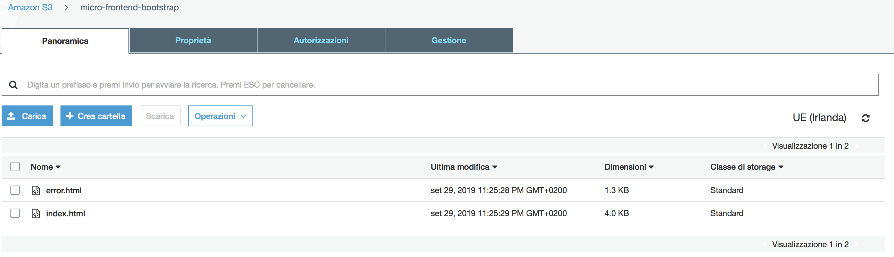
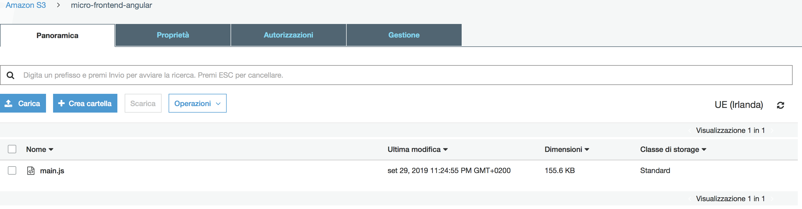
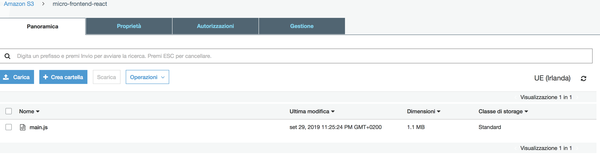
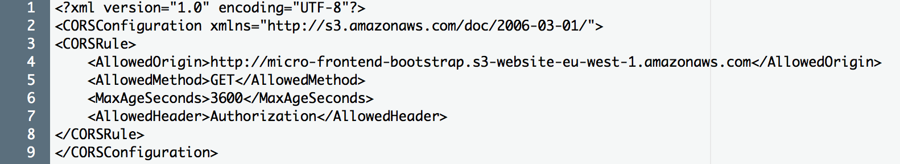
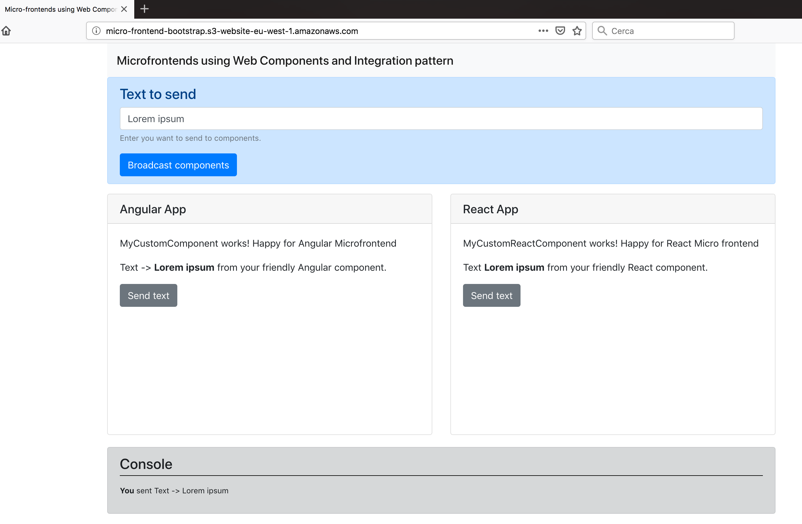

# Micro frontends deployment on AWS
There are different ways to deploy this example: on the main section was explained how to do it through Docker, but we can also deploy these applications on AWS. 

## S3
THe simplest way to deploy applications is to create three different buckets on S3, we'll use it with web hosting feature enabled.
1. Bucket to contain _Bootstrap app_;
2. Bucket to contain _Angular child app_;
3. Bucket to contain _react child app_.

Bootstrapp app will access two child app via bucket domain name of the other two.
To keep things more secure, we'll setup CORS policy on child apps' buckets since all three public must have public access to resources. 

**Bootstrap Bucket**


**Angular Bucket**


**React Bucket**


As we have seen above, you also need to setup CORS policy like the following



### Launch stack
It's possible to launch the stack via Launch stack button below. The next section explains what CloudFormation stacks contain. 

[](https://console.aws.amazon.com/cloudformation/home?region=eu-west-1#/stacks/new?stackName=micro-frontend-s3&templateURL=https://micro-frontend-cf-template.s3-eu-west-1.amazonaws.com/cf-s3-micro-frontend-template.template)

### CloudFormation
I provided a simple CloudFormation nested stack to create the three buckets and CORS policy:
1. **cf-s3-create-bootstrap-app-bucket.yaml**. defines a template for bootstrap bucket creation and provides all the information needed to setup CORS policy for the next CloudFormation nested stacks;
```yaml
AWSTemplateFormatVersion: 2010-09-09
Description: AWS CloudFormation template to create bucket for website hosting
Parameters:
  BucketNameBootstrap:
    Type: String
    Description: Bucket name for bootstrap app
Resources:
  BootstrapBucket:
    Type: 'AWS::S3::Bucket'
    Properties:
      BucketName: !Ref BucketNameBootstrap
      WebsiteConfiguration:
        IndexDocument: index.html
        ErrorDocument: error.html
Outputs:
  BootstrapStackName:
    Description: URL of the bucket bootstrap
    Value: !Ref AWS::StackName
    Export:
      Name: !Ref AWS::StackName
  BootstrapWebsiteURL:
    Description: URL of the bucket bootstrap
    Value: !GetAtt [BootstrapBucket, WebsiteURL]
    Export:
      Name: !Sub "${AWS::StackName}-BootstrapWebsiteURL"
```
2. **cf-s3-create-child-app-bucket-cors**, defines a template for child app bucket creation.
```yaml
AWSTemplateFormatVersion: 2010-09-09
Description: AWS CloudFormation template to create bucket for website hosting
Parameters:
  BucketNameChildApp:
    Type: String
    Description: Bucket name for bootstrap app
  BootstrapBucketStackName:
    Type: String
Resources:
  ChildAppBucket:
    Type: 'AWS::S3::Bucket'
    Properties:
      BucketName: !Ref BucketNameChildApp
      WebsiteConfiguration:
        IndexDocument: index.html
        ErrorDocument: error.html
      AccessControl: Private
      CorsConfiguration:
        CorsRules:
        - AllowedHeaders:
          - 'Authorization'
          AllowedMethods:
          - GET
          AllowedOrigins:
          - 'Fn::ImportValue': !Sub '${BootstrapBucketStackName}-BootstrapWebsiteURL'
          MaxAge: '3600'
Outputs:
  AngularWebsiteURL:
    Description: Child app domain URL
    Value: !GetAtt 
      - ChildAppBucket
      - WebsiteURL
```
3. **cf-s3-micro-frontend-template.yaml**, is the root stack to launch. 
```yaml
AWSTemplateFormatVersion: 2010-09-09
Description: AWS CloudFormation nested stack template
Parameters:
  BucketNameBootstrap:
    Type: String
    Description: Bucket name for bootstrap app
  BucketNameAngular:
    Type: String
    Description: Bucket name for angular app
  BucketNameReact:
    Type: String
    Description: Bucket name for react app

Resources:
  BootstrapBucketStack:
    Type: AWS::CloudFormation::Stack
    Properties:
      TemplateURL: https://micro-frontend-cf-template.s3-eu-west-1.amazonaws.com/cf-s3-create-bootstrap-app-bucket.yaml
      TimeoutInMinutes: '60'
      Parameters:
        BucketNameBootstrap: !Ref BucketNameBootstrap

  AngularAppBucketStack:
    Type: AWS::CloudFormation::Stack
    Properties:
      TemplateURL: https://micro-frontend-cf-template.s3-eu-west-1.amazonaws.com/cf-s3-create-child-app-bucket-cors.yaml
      TimeoutInMinutes: '60'
      Parameters:
        BucketNameChildApp: !Ref BucketNameAngular
        BootstrapBucketStackName: !GetAtt BootstrapBucketStack.Outputs.BootstrapStackName
       
  ReactAppBucketStack:
    Type: AWS::CloudFormation::Stack
    Properties:
      TemplateURL: https://micro-frontend-cf-template.s3-eu-west-1.amazonaws.com/cf-s3-create-child-app-bucket-cors.yaml
      TimeoutInMinutes: '60'    
      Parameters:
        BucketNameChildApp: !Ref BucketNameReact
        BootstrapBucketStackName: !GetAtt BootstrapBucketStack.Outputs.BootstrapStackName
Outputs:
  WebSiteBootstrap:
    Value: !GetAtt BootstrapBucketStack.Outputs.BootstrapWebsiteURL  
```
For practical reasons, I put cf-s3-create-bootstrap-app-bucket.yaml and  cf-s3-create-child-app-bucket-cors in a different S3 bucket where I can reach them publicly. In fact the root stack contains URL to the nested stacks.

If you're not familiar with CloudFormation you can see documentation [here](https://docs.aws.amazon.com/cloudformation/index.html). 


### Deploy stack 
Once you have uploaded your nested stacks on a S3 publicly accessible, you can go through AWS console and search CloudFormation. 
You have to create a new stack and give input information. 

**NOTE**
> Remember that S3 bucket name must be globally unique.

Once you've created S3 buckets, either manually or via CloudFormation, you can upload the content of your builds on buckets like the three images above.

To reach the web application you can use the domain URL of bootstrap bucket, like this in my case: \
http://micro-frontend-bootstrap.s3-website-eu-west-1.amazonaws.com



